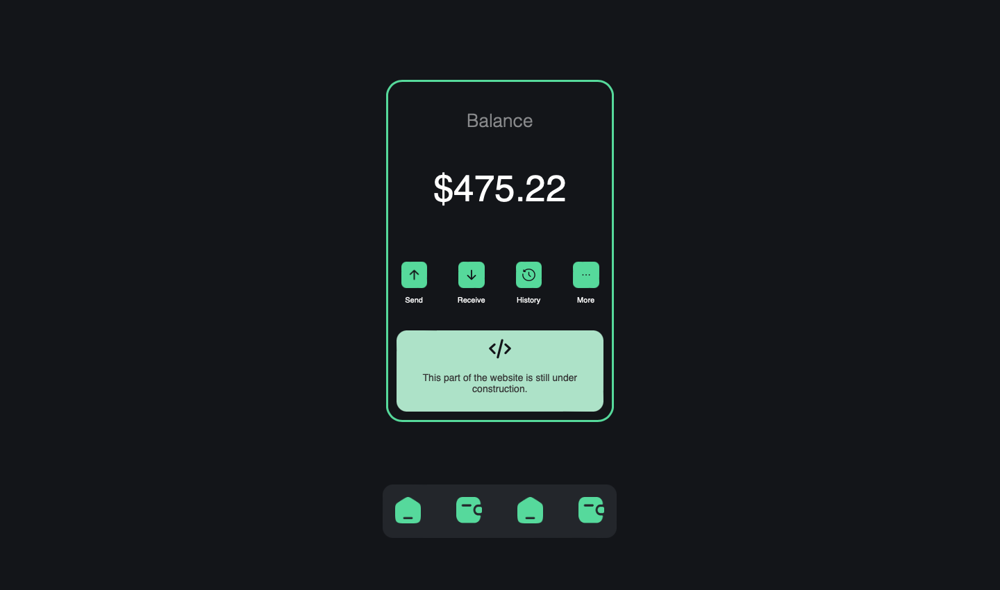

# Coinevoo Wallet Page

This repository contains the source code for the Coinevoo Wallet Page, a web page designed for Coinevoo, a cryptocurrency company.

## Overview

The Coinevoo Wallet Page is a user-friendly dashboard that allows users to manage their cryptocurrency assets. It provides features such as checking the balance, sending and receiving cryptocurrencies, viewing transaction history, and more.

## Technologies Used

- HTML5
- CSS3
- JavaScript 

## Usage

To view the Coinevoo Wallet Page, simply open the `index.html` file in a web browser. You can also deploy this page to a web server for public access.

## Folder Structure

- `css/`: Contains the CSS stylesheet (`styles.css`) used for styling the page.
- `assets/`: Includes images and icons used in the wallet page.
- `index.html`: The main HTML file that represents the Coinevoo Wallet Page.

## Development

Feel free to fork this repository and make any necessary modifications to adapt it to your specific needs. You can customize the design, add functionality, or integrate it with a backend to make it functional.

We welcome contributions and feedback to improve this wallet page. Please feel free to open issues or create pull requests.

